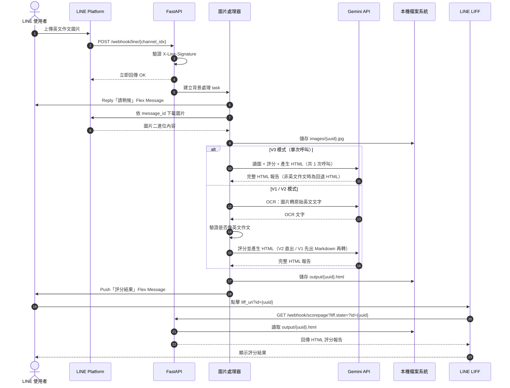

# LINE 英文作文 AI 評分系統：現況基線與擴充指南

> 本文件依據目前 `line_webhook` 原始碼整理，用來描述「已完成且正在運作的系統」，並作為後續新增功能的共同基線。  
> 文件日期：2026-08-06
>
> 對應原始碼：`main` 分支，commit `8a632b6`
>
> 目前啟用模式：V3 單次 Gemini 呼叫
>
> 2026-08-07 更新：新增設定熱更新 `POST /config/reload`（不重啟即套用 YAML 變更）

## 1. 系統目的

本系統把 LINE 官方帳號作為學生端入口，讓使用者直接上傳英文作文圖片。FastAPI 後端收到 LINE Webhook 後，從 LINE 下載圖片，再依設定的 V1、V2 或 V3 流程使用 Gemini 完成文字辨識、作文評分與 HTML 生成，最後透過 LINE Flex Message 把 LIFF 報告入口推送給使用者。目前正式設定為 V3，由 Gemini 在一次多模態呼叫中直接讀圖、評分並產生 HTML。

使用者不需要離開 LINE，也不需要手動輸入作文內容，即可完成：

1. 上傳英文作文圖片。
2. 等待系統辨識與評分。
3. 收到 LINE 評分完成通知。
4. 在 LIFF 頁面查看完整 HTML 評分報告。

## 2. 已完成的端到端流程



## 3. 核心元件與責任

| 元件 | 目前責任 |
|---|---|
| `main.py` | 建立 FastAPI、接收 LINE Webhook、驗證頻道與簽章、分派事件、提供評分頁與 CSS，並提供 `POST /config/reload` 設定熱更新端點。 |
| `handlers.py` | 處理文字、圖片、音訊與 Postback 事件；圖片 OCR、評分及 LINE 回覆的主要流程位於此處。 |
| `gemini.py` | 封裝 Gemini REST API 呼叫，包含圖片 OCR、音訊轉寫、作文評分、直接產生 HTML、V3 的讀圖單次評分，以及 V1 的 Markdown 轉 HTML。 |
| `english_essay.py` | 依字數、句數與句首大寫比例，初步判斷 OCR 結果是否為英文作文。 |
| `line_utils.py` | 執行 LINE Webhook HMAC-SHA256 簽章驗證，以及建立 LINE Messaging API client。 |
| `config.py` | 合併公開與機密設定、載入 Prompt，並匯出程式使用的設定常數。載入邏輯包裝為可重複執行的 `load()`，運行中呼叫即可熱更新（不重啟）；其他模組以 `config.XXX` 動態取值。 |
| `settings.yaml` | 保存非機密設定，包括模型、評分模式、LIFF URI、Flex Message 與 Prompt 路徑。 |
| `settings.local.yaml` | 保存 Gemini API Key、LINE Channel Secret、Access Token 及 `reload_token` 等機密資料；不納入 Git。 |
| `prompt/` | 保存 OCR、評分與 HTML 輸出規格所使用的提示詞。 |
| `images/` | 保存從 LINE 下載的作文圖片，檔名為 UUID。 |
| `output/` | 保存評分結果；V2/V3 為 `.html`，V1 另有中間 `.md`。 |
| `static/scorepage.html` | LIFF 沒有帶入有效報告 ID 時顯示的預設頁面。 |

## 4. Webhook 與事件分派

主要入口為：

```text
POST /webhook/line/{channel_idx}
```

`channel_idx` 對應 `settings.yaml` 內 `line` 陣列的索引，因此同一套 FastAPI 可以服務多個 LINE Channel。每個 Channel 可擁有自己的：

- Channel Secret
- Channel Access Token
- 管理員 LINE User ID
- 群組管理指令前綴
- LIFF URI
- Rich Menu ID

FastAPI 先用該 Channel 的 Secret 驗證 `X-Line-Signature`，驗證通過後才解析事件：

| LINE 事件 | 處理函式 | 執行方式 |
|---|---|---|
| 圖片訊息 | `handle_image_message()` | `asyncio.create_task()` 背景執行 |
| 音訊訊息 | `handle_audio_message()` | `asyncio.create_task()` 背景執行 |
| 文字訊息 | `handle_message()` | 直接 `await` |
| Postback | `handle_postback()` | 直接 `await`，目前尚未實作行為 |

圖片與音訊處理耗時較長，因此 Webhook 不等待 AI 工作完成，而是快速向 LINE 回傳 `OK`，避免 Webhook 長時間占用連線。

另有管理端點 `POST /config/reload?token=<reload_token>`：驗證 token 後呼叫 `config.load()` 重新讀取全部設定，供運維在改完 YAML 後熱更新，不需重啟服務。

## 5. 圖片作文評分流程

### 5.1 接收與限制檢查

圖片事件進入 `handle_image_message()` 後，系統依序執行：

1. 若訊息來自群組，只接受該 Channel 設定的管理員上傳。
2. 檢查同一使用者是否已有圖片正在處理。
3. 檢查使用者當日使用次數。
4. 使用 Reply Message 回傳「請稍候」Flex Message。
5. 使用 LINE Blob API 下載原始圖片。
6. 產生 UUID，保存為 `images/{uuid}.jpg`。

目前限制為每位使用者每天最多 10 張圖片，以 `Asia/Taipei` 日期計算。同一使用者在前一張圖片完成前不能重複送出下一張。

### 5.2 Gemini OCR

`ocr_image()` 將 JPEG 轉成 Base64，連同 `GEMINI_OCR_PROMPT` 呼叫 Gemini `generateContent` API。現有 Prompt 要求模型：

> 只辨識圖片內的英文作文，不修改、不補充內容。

Gemini API Key 來自 `GEMINI_API_KEYS`，每次呼叫以 `random.choice()` 隨機選取一組。

> **注意**：此步驟僅在 V1 / V2 模式執行。V3 模式將 OCR 併入評分呼叫，由模型直接讀圖。

### 5.3 英文作文初步驗證

OCR 完成後，`is_english_essay()` 會檢查：

- 內容不可為空。
- 至少 30 個單字。
- 至少 2 個句子。
- 至少 50% 的句子以大寫字母開頭。

若不符合條件，系統不進行評分，改用 Push Message 告知使用者原因。

> **注意**：此 Python 檢查依賴 OCR 中間文字，僅在 V1 / V2 模式執行。V3 模式沒有獨立 OCR 文字，改由模型依 V3 提示詞判斷，非英文作文時直接輸出「這不是一篇英文作文」的回退 HTML。

### 5.4 評分模式

目前由 `settings.yaml` 的 `scoring_mode` 切換三種流程；原始碼目前設定為 `v3`。若設定值不是 `v1` 或 `v3`，現有 handler 會走 V2 分支。

#### V3：目前啟用的單次呼叫流程（`scoring_mode: v3`）

```text
圖片 → Gemini 單次呼叫直接讀圖（OCR + 評分 + HTML 一併完成）→ 輸出 HTML
```

- Gemini 呼叫共 **1 次**。
- `score_essay_from_image()` 以圖片 Base64 內嵌呼叫 Gemini，使用 `prompt/elementary_prompt_html_direct.txt`（OCR 指示 + 評分規約 + HTML 輸出格式合併）。
- 跳過 `ocr_image()` 與 `is_english_essay()`；非英文作文由模型輸出固定回退 HTML。
- 最終寫入 `output/{uuid}.html`，不產生 Markdown 中間檔。
- 最低延遲與 API 成本的路徑。
- 即使模型判定不是英文作文，使用者仍會收到評分結果 Flex Message，並在 LIFF 中看到回退 HTML；這與 V1/V2 直接推送文字原因的行為不同。

#### V2：保留的兩次呼叫流程（`scoring_mode: v2`）

```text
圖片 → Gemini OCR → 英文作文驗證 → Gemini 評分並直接輸出 HTML
```

- Gemini 呼叫共 2 次。
- `score_essay_direct_html()` 使用 `prompt/elementary_prompt_html.txt`。
- 評分規則與 HTML 格式要求合併在同一個 Prompt。
- 最終寫入 `output/{uuid}.html`。
- 不產生 Markdown 中間檔。

#### V1：保留的相容流程

```text
圖片 → Gemini OCR → 英文作文驗證 → Gemini 評分成 Markdown → Gemini 轉 HTML
```

- Gemini 呼叫共 3 次。
- `score_essay()` 先寫入 `output/{uuid}.md`。
- `md_to_html()` 再將 Markdown 轉為 `output/{uuid}.html`。

三種模式輸出的 HTML 都會先移除 Gemini 可能附加的 Markdown code fence，再依 `logo_url` 注入報告 Logo。

## 6. HTML 報告與 LIFF 傳遞

評分成功後，後端推送一則「評分結果」Flex Message，按鈕 URI 為：

```text
{liff_uri}?id={uuid}
```

使用者點擊後，LINE LIFF 會把 `?id={uuid}` 包裝到 `liff.state`，再開啟 Endpoint URL。FastAPI 的報告路由為：

```text
GET /webhook/scorepage?liff.state=?id={uuid}
```

後端從 `liff.state` 解析 `id`，並回傳：

```text
output/{uuid}.html
```

找不到指定報告時回傳 404；沒有 `liff.state` 時則顯示 `static/scorepage.html`。

因此，LIFF 在此系統的主要作用是提供 LINE 內建瀏覽環境與報告入口；實際 HTML 內容仍由 FastAPI 從伺服器檔案系統提供。

## 7. LINE 端其他既有功能

### 7.1 文字指令

| 指令 | 行為 |
|---|---|
| `grade` | 回傳評分 Flex Message，按鈕連至該 Channel 的 LIFF URI。 |
| `welcome` | 回傳歡迎 Flex Message。 |
| `upload` | 回傳圖片上傳提示 Flex Message。 |
| `menu` / `選單` | 將指定 Rich Menu 綁定到使用者。 |
| 其他文字 | 私訊中 Echo 原文字，並顯示 User ID；有 Group ID 時一併顯示。 |

群組內只有管理員本人，並且使用設定的 `admin_prefix` 作為前綴，才會觸發文字指令。

### 7.2 音訊轉寫

系統也支援 LINE 音訊訊息：下載音訊、依 Content-Type 決定副檔名、交給 Gemini 轉寫，最後以文字 Reply。群組音訊同樣只接受管理員。

### 7.3 Postback

`handle_postback()` 已有事件入口，但函式目前為空，適合作為下一階段互動功能的擴充點。

### 7.4 服務管理 CLI

`menu.sh` 除了原有的互動式選單，現在也能直接接受命令列參數，方便人工維運、部署腳本或遠端操作：

| 指令 | 行為 |
|---|---|
| `bash menu.sh start` | 背景啟動 FastAPI／Uvicorn 服務。 |
| `bash menu.sh stop` | 停止 PID 檔記錄的服務。 |
| `bash menu.sh restart` | 依序停止並重新啟動服務。 |
| `bash menu.sh status` | 顯示執行狀態、PID 與 Port。 |
| `bash menu.sh log` | 顯示 `hook.log` 最後 50 行。 |
| `bash menu.sh follow` | 持續追蹤 `hook.log`。 |
| `bash menu.sh clean` | 詢問確認後清除 Log。 |
| `bash menu.sh clean -y` | 不詢問，直接清除 Log。 |
| `bash menu.sh help` | 顯示 CLI 說明。 |
| `bash menu.sh` | 不帶參數時開啟互動式選單。 |

服務固定使用專案目錄下的 `bin/uvicorn`，監聽 Port `9000`，並以 `.hook.pid` 與 `hook.log` 保存程序及日誌資訊。

## 8. 設定與機密管理

設定採兩層結構：

```text
settings.yaml       公開設定，可納入版本控制
settings.local.yaml 機密設定，不納入版本控制
```

啟動時，`config.py` 先讀取 `settings.yaml`，再以 `settings.local.yaml` 中的 Gemini Key 與 LINE Channel 設定逐項覆蓋。大型 Prompt 使用字串形式的 `!include path` 載入。

載入邏輯包裝為 `config.load()`，可在運行中重新執行。修改任一套設定後，呼叫 `POST /config/reload?token=<reload_token>`（或 `bash menu.sh reload`）即熱更新，不需重啟服務；熱更新只替換 `config` 模組的常數，不會重置 `handlers.py` 內的每日用量與處理中狀態。`reload_token` 存放於 `settings.local.yaml`（未提供時 `RELOAD_TOKEN` 為空字串，reload 端點將無法通過驗證）。

重要設定包括：

| 設定 | 用途 |
|---|---|
| `llm_model` | Gemini 模型，目前設定為 `gemini-3.1-flash-lite`。 |
| `scoring_mode` | 選擇 V1（3 次呼叫）、V2（2 次呼叫）或 V3（1 次呼叫）評分流程；目前設定為 `v3`。 |
| `max_output_tokens` | 控制 Gemini 最大輸出，目前為 32768，避免 HTML 被截斷。 |
| `logo_url` | 注入評分 HTML 的 Logo。 |
| `reload_token` | 設定熱更新端點 `POST /config/reload` 的驗證 token（存放於 `settings.local.yaml`）。 |
| `gemini_ocr_prompt` | OCR 行為規格（V1/V2 使用）。 |
| `elementary_prompt` | V1 評分規格。 |
| `elementary_html_prompt` | V2 評分及 HTML 輸出規格。 |
| `elementary_html_direct_prompt` | V3 直接讀圖、評分及 HTML 輸出規格。 |
| `MD_TO_HTML_PROMPT` | V1 的 Markdown 轉 HTML 規格。 |

## 9. 目前資料保存方式

系統尚未使用資料庫，資料以本機記憶體與檔案保存：

| 資料 | 保存位置 | 生命週期 |
|---|---|---|
| 正在處理的 User ID | `_processing_users` 記憶體集合 | Process 重啟即消失 |
| 每日使用次數 | `_user_daily_usage` 記憶體字典 | Process 重啟即歸零 |
| 原始作文圖片 | `images/{uuid}.jpg` | 持續保留，除非人工清理 |
| 音訊 | `audios/{uuid}.{ext}` | 持續保留，除非人工清理 |
| 評分報告 | `output/{uuid}.html` | 持續保留，除非人工清理 |
| V1 中間結果 | `output/{uuid}.md` | 持續保留，除非人工清理（僅 V1 模式產生） |

## 10. 後續擴充時應注意的現況

以下不是新需求，而是目前架構在加入功能前需要知道的邊界：

1. **背景工作只存在於 FastAPI Process 中**：`asyncio.create_task()` 沒有持久化；服務重啟時，正在執行的 OCR 或評分工作會中斷。
2. **每日額度只存在記憶體中**：重啟服務會歸零；多 Process 或多台主機之間也不共享。
3. **報告尚未綁定使用者身份**：只要取得 UUID，就可能直接請求對應報告；目前沒有驗證 LIFF ID Token 或報告所有權。
4. **檔案沒有自動清理策略**：圖片、音訊與 HTML 會持續累積。
5. **沒有資料庫與歷史紀錄索引**：目前無法直接查詢某位學生過往作文、分數趨勢或教師批閱紀錄。
6. **Gemini 錯誤處理較簡單**：尚未完整處理 HTTP 錯誤、逾時、重試、配額不足、內容被截斷或無效 HTML。
7. **沒有獨立工作佇列**：大量同時上傳時，所有工作都由同一個應用程序處理。
8. **Flex Message 模板是共用 dict**：程式會直接改寫其中的 LIFF URI；後續增加更高併發或更多頻道時，宜改為每次 deep copy 後再填值。
9. **Postback 尚未實作**：現有 Flex Message 中已有 Postback 按鈕，但目前點擊後沒有後端行為。
10. **目前沒有自動化測試**：新增功能前宜先為簽章、作文判定、`liff.state` 解析與評分工作流程補測試。
11. **V3 失敗時可能產生無效報告連結**：`score_essay_from_image()` 在 Gemini 回覆無有效欄位時只回傳錯誤字串，不會建立 HTML 檔；handler 目前仍會推送結果按鈕，使用者點擊後可能得到 404。
12. **評分模式設定沒有白名單驗證**：除了明確的 `v1` 與 `v3`，其他字串目前都會落入 V2 分支；拼字錯誤不會在啟動時被發現。

## 11. 建議的功能擴充方向

可以在不改變現有使用流程的前提下，依下列順序擴充：

### 第一階段：可靠性與安全性

- 建立統一的 Gemini client，加入 timeout、retry、錯誤分類及結構化 log。
- 驗證 LIFF ID Token，並把報告 UUID 綁定 LINE User ID。
- 將每日額度與工作狀態移至 Redis 或資料庫。
- 建立圖片及報告的保存期限與排程清理機制。
- 加入處理失敗通知，避免使用者只收到「請稍候」卻沒有最終結果。

### 第二階段：學生與教師功能

- 作文歷史紀錄與重新開啟報告。
- 分數趨勢、常見錯誤統計及弱項分析。
- 年級、考試類型或評分標準選擇。
- OCR 文字確認與手動修正後再評分。
- 教師覆核、留言與人工調整分數。
- 針對原文逐句標註錯誤與建議改寫。

### 第三階段：平台化

- 將 OCR、評分與報告生成拆成可追蹤的 Job。
- 使用 Queue Worker 處理 AI 任務。
- 將本機檔案搬到 Object Storage。
- 建立管理後台、使用量分析與 API 成本統計。
- 支援多種模型、Prompt 版本與 A/B 測試。

## 12. 建議新增功能時使用的描述格式

後續每一項功能可用以下模板規劃，便於確認影響範圍：

```md
### 功能名稱

- 使用者情境：誰在什麼情況下使用？
- LINE 入口：文字、圖片、Rich Menu、Flex 按鈕或 Postback？
- API 變更：新增或修改哪些 Endpoint？
- 資料需求：是否需要資料庫、快取或檔案？
- AI 流程：是否增加 Gemini 呼叫或修改 Prompt？
- 輸出：LINE 訊息、LIFF HTML 或其他格式？
- 權限：學生、教師、管理員如何區分？
- 失敗處理：逾時、重試與通知方式？
- 驗收條件：什麼結果代表功能完成？
```

## 13. 現況摘要

目前系統已完成以下核心閉環：

```text
LINE 上傳圖片
→ FastAPI 驗證並接收 Webhook
→ 從 LINE 下載圖片
→ [目前 V3] Gemini 直接讀圖、判定、評分並產生 HTML
  或 [V1/V2] Gemini OCR → Python 作文格式檢查 → Gemini 評分
→ 產生並保存 HTML
→ LINE Push 評分結果
→ 使用者透過 LIFF 查看報告
```

其中 `scoring_mode` 決定評分路徑：V1 共 3 次 Gemini 呼叫、V2 共 2 次（OCR + 評分直出 HTML）、目前啟用的 V3 共 1 次（直接讀圖，同時完成 OCR、評分與 HTML 輸出，跳過 Python 作文格式檢查）。三種模式輸出結構相同，LIFF 報告頁不需區分模式。

這個版本已具備可實際使用的 MVP 流程。下一階段若要加入學生歷史、教師管理、計費或大量併發，核心工作會從「完成 AI 評分」轉向「身份、資料持久化、任務可靠性與可觀測性」。
