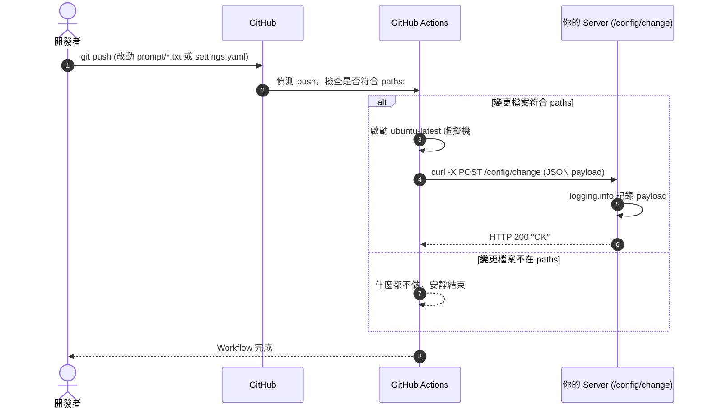

# 2026-08-07 新增 `/config/change`：GitHub Actions 檔案變更通知整合（第一階段：僅記錄）

## 改動動機

希望「只有指定設定/提示詞檔案（如 `prompt/elementary_prompt_html_direct.txt`）被推送時」，GitHub 才通知伺服器，讓伺服器能在不重啟、不手動介入的情況下掌握設定異動。

本階段先在伺服器端建立接收端點 `POST /config/change`，**僅將通知內容記錄至 log**，不做任何後續動作（真正的自動 reload 留待下一階段）。GitHub 端負責監控檔案並發送 HTTP 通知。

---

## 三個角色的分工

| 角色 | 動作 |
|---|---|
| **你（開發者）** | 修改檔案並 `git push`。 |
| **GitHub Actions（雲端機器人）** | 監控 `paths:` 指定的檔案變化，只有符合時才執行 `curl` 發送通知。 |
| **你的 Server（REST API）** | 接收 `/config/change` 通知，本階段將 payload 寫入 log。 |

---

## 完整運作流程（時序圖）



---

## 伺服器端變更（本階段已實作）

### `main.py` — 新增 `POST /config/change`

```python
@app.post("/config/change")
async def config_change(request: Request):
    body = await request.body()
    try:
        payload = json.loads(body.decode("utf-8"))
        logging.info(f"[CONFIG-CHANGE] {payload}")
    except (json.JSONDecodeError, UnicodeDecodeError):
        logging.info(f"[CONFIG-CHANGE] (raw) {body.decode('utf-8', errors='replace')}")
    return "OK"
```

- 一律回 HTTP 200，讓 GitHub Workflow 確認接收成功
- 解析失敗時仍記錄原始 body，不因格式問題漏記
- **不呼叫 `config.load()`、不觸發 reload 或任何業務行為**（下一階段）

---

## GitHub 端需要做的事

### 1. 關閉舊 Webhook

進入 GitHub `Settings` ➔ `Webhooks`，刪除或停用原本「全域觸發」的 Webhook，避免每次 push 都發通知。

### 2. 建立 Workflow 設定檔

在 GitHub 網頁建立 `.github/workflows/webhook-on-file-change.yml`：

```yaml
name: Notify Server on File Change

on:
  push:
    branches: [main]
    paths:
      - 'prompt/**'
      - 'settings.yaml'

jobs:
  notify:
    runs-on: ubuntu-latest
    steps:
      - name: Send config change notification
        run: |
          curl -X POST https://tpe-info.blossom-academy.uk/config/change \
            -H "Content-Type: application/json" \
            -d '{
                  "event": "file_changed",
                  "repository": "${{ github.repository }}",
                  "commit": "${{ github.sha }}",
                  "ref": "${{ github.ref }}",
                  "file_url": "https://raw.githubusercontent.com/fukushiYu/line_webhook/refs/heads/main/prompt/elementary_prompt_html_direct.txt"
                }'
```

### 3. 微調設定

- **`paths:`**：改成你要監控的檔案路徑（上例為 `prompt/**` 與 `settings.yaml`；也可精準到單一檔案如 `prompt/elementary_prompt_html_direct.txt`）。
- **`curl` 網址與 payload**：換成你的正式 API 位址與要傳送的 JSON 內容。

> 進階：若想動態帶出「實際變更的檔案」，可改用 `${{ github.event.head_commit.modified }}` 組合 `file_url`，本範本先使用固定的提示詞檔路徑。

### 4. 測試

1. 先用 [Webhook.site](https://webhook.site/) 測試 GitHub 是否正確觸發、payload 內容是否符合預期。
2. 確認沒問題後，把 `curl` 網址換成正式 API：`https://tpe-info.blossom-academy.uk/config/change`。
3. Push 一筆變更，到伺服器 `hook.log` 確認出現 `[CONFIG-CHANGE] {...}` 記錄。

---

## 行為與相容性

- 只有 `paths:` 指定的檔案變更才觸發，達到「精準控制、不濫發通知」。
- `/config/change` 目前純記錄，不影響 LINE Webhook、評分流程、`/config/reload` 熱更新。
- 已同步更新 `openspec/specs/webhook-api` 主規格（新增「設定變更通知端點」）。
